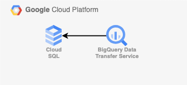

# CloudSQLからBigQueryに接続する手順

  

## 概要

このリポジトリでは、Terraformを使用してCloudSQLとBigQueryを接続するための設定を行います。以下の手順に従ってください。

## 手順
### 1. Terraform設定ファイルの準備

まず、以下のコマンドを実行して、必要な環境設定を行います。
'''
bin/make_tfvars
'''
### 2. Terraformの適用
次に、Terraformの設定を適用します。

'''
bin/terraform_apply
'''
これにより、必要なインフラ（CloudSQLインスタンス、BigQuery接続設定など）が作成されます。

### 3. CloudSQLの設定
CloudSQLのインスタンスが作成されたら、Google Cloud Consoleを開き、dump.sqlファイルをアップロードします。

次に、以下のコマンドを実行してCloudSQLに接続します。
'''
gcloud sql connect mydb --user=terraformmysql --quiet
'''
passwordを入力して、以下のSQLコマンドを実行します。

'''
CREATE DATABASE mydb;
USE mydb;
SOURCE /home/mmingriha/dump.sql;
'''
これにより、dump.sqlに含まれるデータがmydbデータベースにインポートされます。

4. BigQueryで外部クエリの実行
次に、BigQueryに移動し、以下のクエリを実行します。

'''
SELECT *
FROM EXTERNAL_QUERY("your_project.asia-northeast1.cloudsql-connection", "SELECT * FROM sales_data;");
'''

これにより、CloudSQLのmydbデータベースからexternal_queryを通じてbigqueryにデータをインポートすることができます。

